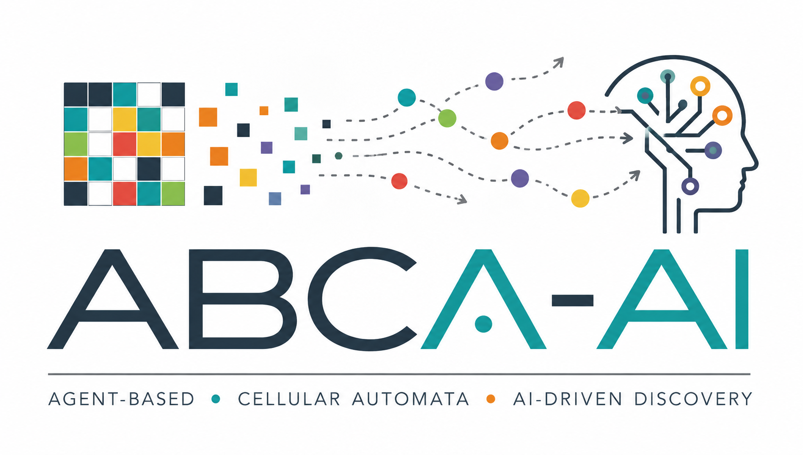

  

**ABCA-AI** is an AI-driven framework for **automated discovery, implementation, and evaluation of agent-based models**.

It uses teams of specialized AI agents to analyze experimental data, formulate and compare candidate mechanisms, implement models in **ABCA**, and quantitatively evaluate their ability to reproduce observed behaviours. A modular tool and prompt system separates scientific reasoning, mathematical analysis, biological interpretation, model implementation, optimization, and critical evaluation.

